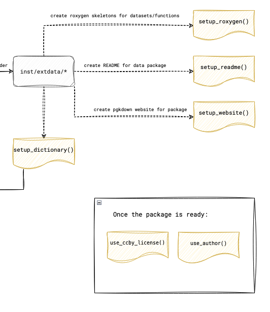

# Documenting Your Dataset {#sec-datadocumentation}

```{r, include=FALSE}
library(washr)
```

In the next steps, the goal is to document not only the dataset itself but also the functions and the package as a whole. The individual steps are visualized in the figure below.

{fig-align="center" style="border: 1px solid black;"}

## Setting Up and Writing Documentation with Roxygen

To begin documenting your dataset, start by initializing Roxygen documentation. Open your R console within the project and run the following command:

```{r}
setup_roxygen()
```

This will create the necessary documentation files in the `R/` folder of your project, setting up the foundation for detailed documentation.

### Writing Documentation

Once the documentation files are generated, navigate to the `R/` folder in your project. Each file in this folder, with a `.R` extension, represents a dataset or function. Open these files and provide a human-readable title and description using Roxygen comments (lines that start with `#'`). For instance, you could use the following format to document your dataset:

```
#' Title of Your Dataset
#'
#' A brief description of what the dataset contains and its purpose.
#'
#' @format A data frame with X rows and Y columns:
#' \describe{
#'   \item{column1}{Description of column1}
#'   \item{column2}{Description of column2}
#'   ...
#' }
#' @source Where the data comes from (if applicable)
"dataset_name"
```

This method allows you to provide clear, concise details about each dataset, ensuring that users understand its structure and purpose.

### Updating Your GitHub Repository

Once you've completed the documentation, it’s time to update your GitHub repository. In RStudio, go to the "Git" tab. Stage all the changed files by checking the boxes next to them, then click "Commit". Write a meaningful commit message, such as "Add Roxygen documentation for dataset", and click "Push" to update your repository with the latest changes.

### Finalizing and Installing the Documentation

Now that your documentation is written, run the following commands in your R console:

```{r}
devtools::document()
devtools::check()
devtools::install()
```

These commands will generate the documentation from your Roxygen comments, check for any issues in the package, and install it locally. If you receive a warning about the license, don’t worry, as it will be addressed in the next section.

## Updating the DESCRIPTION File

To complete your package documentation, you’ll need to update the `DESCRIPTION` file with author information and other key details.

### Adding Yourself as an Author

In your R console, add yourself as the author and maintainer by running:

```{r}
use_author(
  given = "Your First Name", 
  family = "Your Last Name", 
  role = c("aut", "cre"), 
  email = "your.email@example.com",
  comment = c(ORCID = "XXXX-XXXX-XXXX-XXXX")
)
```

Here, `aut` indicates that you are an author, and `cre` designates you as the creator or maintainer of the package.

### Documenting Other Contributors

To ensure proper credit is given, create a new issue in your GitHub repository titled "Author Information for DESCRIPTION File". List all contributors, including their full name, email address, role (e.g., `aut` for authors or `ctb` for contributors), and ORCID (if applicable).

For each additional contributor, run a similar command:

```{r}
use_author(given = "Coauthor First Name", family = "Coauthor Last Name", role = "aut")
```

### Updating the DESCRIPTION File

After adding all contributors, open the `DESCRIPTION` file in your project and ensure the title and description reflect the purpose of your package accurately. Then, in your R console, run:

```{r}
update_description()
```

This will update fields such as version, authors, and dependencies. Review the `DESCRIPTION` file to make sure all information is accurate.

### Documentation Check

To complete the process, run the following commands again:

```{r}
devtools::document()
devtools::check()
devtools::install()
```

## FAIR Documentation

One function derives the machine readable metadata of your package from the files you have already written: `DESCRIPTION`, `data-raw/dictionary.csv`, `CITATION.cff` and the exports in `inst/extdata`. Nothing is edited by hand; when a value is wrong, change its source and run the function again.

### Keywords and coverage

Three facts have no other home, so they live in `DESCRIPTION`. Open the file and add three lines, with your own values:

```
X-schema.org-keywords: sanitation, faecal sludge, Kampala
X-schema.org-spatialCoverage: Kampala, Uganda
X-schema.org-temporalCoverage: 2022-03-01/2022-09-30
```

The keywords are a comma separated list. The spatial coverage is a place name. The temporal coverage is the first and the last date of the data, separated by a slash.

### Generating the metadata

In your R console run:

```{r}
update_metadata()
```

The function writes a schema.org description of your dataset as JSON-LD into `pkgdown/templates/in-header.html`. The website build in the next chapter embeds it in the head of every page, where dataset search engines such as Google Dataset Search read it. The function ends with a list of the fields it could not fill and where to fill them.

Run it again after every change to `DESCRIPTION`, the dictionary or the exports, and once more after the DOI exists (see @sec-doi). A second run with nothing changed writes nothing.

### Final Documentation Check

To complete the process, run the following commands again:

```{r}
devtools::document()
devtools::check()
devtools::install()
```

These steps will ensure your package is fully documented, checked for errors, and ready for use. 